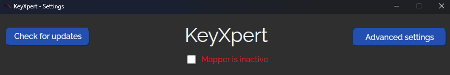
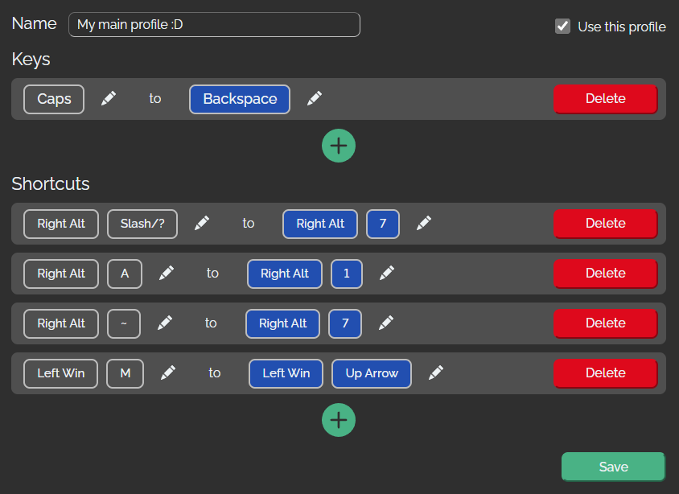
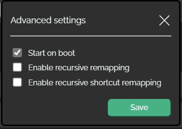

# KeyXpert

## Keyboard remapper for Windows and Linux.

## How to install?

1. Download the latest installation file from [Releases tab](https://github.com/TDiblik/KeyXpert/releases).
2. Follow the installer.
   - Make sure to install it into `C:\Program Files\KeyXpert\`. This path is currentlly hard-coded because there were some issues with the mapper service start on windows boot.
   - If, for whatever reason, the installer does not start with admin privelages automatically, please, run it as Administrator.
   - This program **WILL trigger your anti-virus (sooner or later)**, make sure to turn it off and create a rule to ignore `C:\Program Files\KeyXpert` (more info in notes section, btw don't be scared, check the source code yourself to see that the program is not a malware, or alternativelly, compile it yourself from scratch, if you don't trust my bundles).
3. If you already have a version of KeyXpert installed, you can use the "Check for updates" button to automatically check for updates and install the latest version.

## How to use?

### Meta

- On first open, the program will automatically set configuration defaults (most notably, mapper service will set itself to start after boot, UI != mapper service, so you won't see anything after boot, it will just work automatically).
- UI will remember it's last size and position and respect it on every launch.
- UI and mapper service are completely separated (separate exe(s) and processes). Mapper service is the thing that does the remapping. This service is lightweight and starts on every boot (unless turned off in settings). UI on the other hand is more resource intensive, but won't start automatically (you have to manually start the program).

### Top Row

- "Check for updates" => This button will check github releases for new versions of KeyXpert. If it finds a new version, it will ask you whether or not you want to update. If you want to update, the program will automatically update itself and after a while open an installer window, where you have to agree to install a new version.
- "Advanced settings" => This button will open an "Advanced settings" modal window. More on that below.
- "Mapper is inactive / active" => The current state of the mapper service. This setting does not effect whether the service is active after boot (you have to change that in Advanced settings). You can manually start or stop the mapper service by clicking the checkbox.

### Profile Selection Row

- "Selector" => Here, you can select your profiles. By selecting, you will reveal profile settings. Current profile in use will always be highlited blue in the selector.
- "Add profile" => Generates a new profile. Don't be scared by the generated name, you can change it.
- "Delete profile" => Removes currently selected profile. This action is irreversible.

### Profile settings section

- "Name" => You can change your profile name here.
- "Use this profile" => Since you have many profiles, you have to select which one you want to use. You can only have one profile in use at a time.
- "Keys" => If you want to remap a single key, you can add it by pressing the "+ (plus) icon/button", or edit it by pressing the "pencil icon" and then pressing the desired button. In the example above, you can see, that I'm remapping the "Caps lock" key to "Backspace" key. This means that every time, I press the "Caps lock" key on my keyboard, the "Backspace" key will get executed instead.
- "Shortcuts" => Works exactly the same as "Keys" section, but you're required to hold one of the "function keys" (ctrl/alt/shift/windows) while remaping (except for windows key, which can only be pressed once).
- "Save" => This button will save the current profile configuration and restart the mapper service (when relevant).
- "No active profile (unable to start remapping)" => This yellow warning label is not included in the screenshot, however it will be visible at the bottom of the program, whenever you don't have any active profiles. To fix this, create a profile, or edit an existing one, and select the "Use this profile" box.

### Advanced settings modal

- "Start on boot" => Whether or not to start the mapper service after system boot.
- "Enable recursive remapping" => Your mappings will be recursive, so if you remap from A to B and from B to C, if you then proceed to press A, you will see the letter C pop-up. You should not activate/check this, unless you know what you are doing.
- "Enable recursive shortcut remapping" => Your mappings will be recursive, so if you remap from CTRL+A to CTRL+B and from CTRL+B to CTRL+C, if you then proceed to press CTRL+A, you will execute CTRL+C. You should not activate/check this, unless you know what you are doing.
- "Save" => Saves the configuration to a file and applies the changes immediately.

## Development

### Mapper service

Run `cargo r` from the `mapper_service` directory root.

### UI

Run `npm run tauri dev` from the `ui` directory root (make sure to run `npm i` beforehand).

### Publishing

1. Run `./release.sh` from project directory root.
   - Make sure to bump the version inside of the release script.
2. `git add .`
3. `git commit -m "[Chore] Bump version to vX.X.X"`
4. `git tag vX.X.X`
5. `git push origin master --tag`
6. Create new release and add following files from `release_build` directory:
   - generated `.msi` (eg. KeyXpert_X.X.X_x64_en-US.msi)
   - LICENSE

### TODOs

- Write tests for mapper_service (sometime in the future, before making major future/breaking changes to it).

## Limitations / Notes

1. This program **WILL trigger your anti-virus (sooner or later)** (which makes sence, it literally uses similar techniques as keylogging). I could go and sign the bundle, and then verify it, and spend a lot of time persuading Windows that this is not in fast malware, etc, etc, but that would be a lot of work (I'll probably do it if it gets popular). For now, please turn off your anti-virus while installing and create a rule to ignore `C:\Program Files\KeyXpert`.
2. If you have `RECURSIVE_REMAPPING` enabled (not recommended, but somebody may like it), remapping from Normal keys (A, B, C, etc... ) onto
   System keys (ALT, CTRL, etc) is stable 1 level deep (this will not change, unless some good soul implements it and sends PR :D),
   meaning that if you remap `A` to `CTRL`, **it will work**, but once you proceed to remap `B` to `A`, your `CTRL` will
   get spammed with `KEYDOWN` commands instead of `SYS_KEYDOWN`. This can (and probably will) lead to undefined behavior. I don't plan on
   fixing this, because the number of people who will use `RECURSIVE_REMAPING`, then proceed to rebind Normal key onto System key and then
   rebing another normal key onto the previous normal key is (imo) an asymptote :D (1/x, lame joke, sorry, meaning less than 1 person, nearly 0 people, will need this functionality) and time to implement it is just not worth it.
3. Does not work in lock screen.
4. Unable to remap system shortcuts, however able to add system shortcut functinality to different shortcuts.
5. When remapping windows key, I am technically unable to capture the windows key before windows does, so remapping windows key UI kinda sucks, but works.
